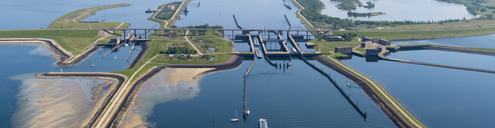

Phase-wise with multiple lockages
~~~~~~~~~~~~~~~~~~~~~~~~~~~~~~~~~

.. :href: https://beeldbank.rws.nl, Rijkswaterstaat

Overview
--------

.. note::

    This example focuses on performing a phase-wise calculation of many lockages based on an input file.
    It assumes basic exposure to the Python interface and phase-wise calculation. 
    If you are a first-time user of the ZSF, see the :doc:`steady` and :doc:`phase` examples.

The purpose of this example is to understand the basic steps to perform a phase-wise calculation of many lockages.
The goal is to determine the average transports of water and salt over a 60-day period.

Initializing the lock
---------------------

When initializing the lock with :py:class:`pyzsf.ZSFUnsteady` we pass all parameters that stay constant throughout the 60-day period.
This includes the parameters for salt intrusion measures like the bubble screens.
Note that the head on the lake side is constant, but that the head on the sea side varies.
Furthermore, the salinity on both sides of the lock varies over time as well.

.. literalinclude:: ../../../examples/python/phase_multiple_lockages.py
  :language: python
  :lines: 8-31
  :lineno-match:

Reading the input data
----------------------

The lockages over the 60-day period are defined in a `CSV-file <https://gitlab.com/deltares/libzsf/-/tree/master/examples/python/lockages.csv>`_:

.. csv-table:: Lockages
   :header-rows: 1

    time,head_sea,routine,salinity_lake,salinity_sea,ship_volume_lake_to_sea,ship_volume_sea_to_lake,t_flushing,t_level,t_open_lake,t_open_sea
    2960.0,0.03760156993333333,3,0.8554550242857143,28.529520582857142,,,,300.0,,
    3380.0,0.03760156993333333,4,0.8554550242857143,28.529520582857142,,1884.2,,,,420.0
    3920.0,0.181197112,1,0.8979030931428571,28.558444978571426,,,,240.0,,
    4280.0,0.181197112,2,0.8979030931428571,28.558444978571426,2482.0,,,,1020.0,
    5420.0,0.74484631,3,1.023605347,28.62057304,,,,340.0,,

We read this CSV file using `pandas <https://pandas.pydata.org/>`_, and convert it to a list of parameter dictionaries:

.. literalinclude:: ../../../examples/python/phase_multiple_lockages.py
  :language: python
  :lines: 33-35
  :lineno-match:

Stepping through all lockages
-----------------------------

Just like in the :doc:`phase` example we step through all phases in the locking cycle.
We do this by iterating over all locking-phase entries defined in the input CSV file.
Depending on the respective phase, we pass either the leveling time, the door-open duration, or the duration of flushing (with the doors closed). 

We store the results of every individual locking phase in a list called ``all_results``, to be aggregated later on in the script:

.. literalinclude:: ../../../examples/python/phase_multiple_lockages.py
  :language: python
  :lines: 37-65
  :lineno-match:

Aggregating output
------------------

For many cases we would only be interested in what happens on the lake side, e.g. the average salt flux in `kg/s` over a certain period of time.
For illustrative purposes we however aggregate all outputs.
For volumes and mass transports this means summing them.
For discharges and salt fluxes, this means averaging them.

.. literalinclude:: ../../../examples/python/phase_multiple_lockages.py
  :language: python
  :lines: 67-91
  :lineno-match:

Finally, the average fluxes are logged to the console

.. literalinclude:: ../../../examples/python/phase_multiple_lockages.py
  :language: python
  :lines: 93-95
  :lineno-match:

The output should show something like:

.. code-block:: text

    Overall results (60 day aggregates and averages):
    {'discharge_from_lake': 2.626938120554457,
     'discharge_from_sea': 2.9855208663562096,
     'discharge_to_lake': 2.7409909136666557,
     'discharge_to_sea': 2.872713264556223,
     'mass_transport_lake': -215507325.24071646,
     'mass_transport_sea': -215288300.05404428,
     'salinity_to_lake': 16.334431315958305,
     'salinity_to_sea': 13.297877648040927,
     'volume_from_lake': 13618047.216954306,
     'volume_from_sea': 15476940.17119059,
     'volume_to_lake': 14209296.896447944,
     'volume_to_sea': 14892145.563459458}

The whole script
----------------

All together, the whole example script is as follows:

.. literalinclude:: ../../../examples/python/phase_multiple_lockages.py
  :language: python
  :lineno-match:
