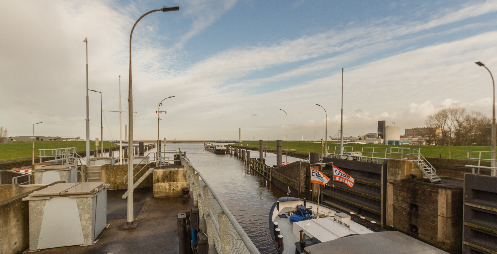

Steady-state calculation
~~~~~~~~~~~~~~~~~~~~~~~~

.. :href: https://beeldbank.rws.nl/MediaObject/Details/479988
.. https://beeldbank.rws.nl, Rijkswaterstaat / Harry van Reeken

Overview
--------

The purpose of this example is to understand the basic steps to calculate the salt transports through a shipping lock in a steady state operation.
The scenario is the following: A single lock connects a canal to the sea, and the lock is busy during the day but quiet during the night.
We want to know how much salt comes in on average, and figure out ways to reduce the salt intrusion by means of mitigating measures like bubble screens.

Properties of the lock and its operation
----------------------------------------

The physical dimensions of our single shipping lock are:

    - length: 148 m
    - width: 14 m
    - bottom: -4.4 mNAP (Dutch Ordnance Datum)

For the boundary conditions we will assume that the sea level is the same as the canal level, with both being equal to 0.0 mNAP.
The salinity on the salt side is significantly higher than on the canal side.

    - salinities: 5 kg/m³ on the canal side close to the lock, and 25 kg/m³ on the sea side
    - head: 0.0 mNAP on both sides
    - temperature: 15.0 °C on both sides

The last step is to derive basic parameters from the locking information.

    - During daytime, the lock operates at a pace of 1.25 cycles per hour (= 30 cycles per 24 hours).
      During the night, the lock operates at a pace of 10 cycles per 24 hours.
    - It takes 5 minutes to open or close the doors on either side, and also 5 minutes to level.
    - There are the same number of ships going from the sea to the canal, and vice-versa.
    - The ships going to and from the canal also have an equal displacement of 1000 m³.

In the first calculation, the lock does not have any sills or bubble screens, nor is there any flushing.
These are of course measures that we will take a look at later in this example to reduce the amount of salt intrusion.

.. seealso::

    For an overview of these parameters, and more in-depth discussion on them, see :ref:`sec_c_api_input` and :ref:`sec_procdef`.

Salt load without measures
--------------------------

The first step in your Python file or Jupyter Notebook is to import ``pyzsf``:

.. literalinclude:: ../../../examples/python/steady.py
  :language: python
  :lines: 1
  :lineno-match:

The next step is to enter all these physical and operational characteristics.
For readability, it can make sense to group the parameters, as can be seen in the code:

.. literalinclude:: ../../../examples/python/steady.py
  :language: python
  :lines: 4-25
  :lineno-match:

We can merge all dictionaries into one set for the daytime, and one set for the nighttime parameters.
This makes passing the arguments later on a bit shorter and easier to understand.

.. literalinclude:: ../../../examples/python/steady.py
  :language: python
  :lines: 27-28
  :lineno-match:

The next step is to actually calculate the salt flux to the lake during day- and nighttime.
As we are assuming constant operation and boundary conditions, we can use the :py:func:`pyzsf.zsf_calc_steady` function.
We log this salt flux to the console.

.. literalinclude:: ../../../examples/python/steady.py
  :language: python
  :lines: 30-36
  :lineno-match:

The console output of these lines is as follows:

.. code-block:: text

    No measures:
    Day = 36.8 kg/s
    Night = 18.8 kg/s

Comparing salt intrusion measures
---------------------------------

The maximum allowable salt load has been determined to be 12 kg/s, so the salt load during daytime and nighttime are currently not acceptable.
The ZSF can help compare various salt intrusion measures that can be taken to reduce the salt load to acceptable levels.
For this particular lock sills are not a feasible option, but bubble screens and flushing discharges could be.

A typical maximally efficient bubble screen can reduce the pace of the lock exchange to about 25%.
We define a new dictionary where we set the density current factor to this percentage on both sides of the lock.

.. literalinclude:: ../../../examples/python/steady.py
  :language: python
  :lines: 38-42
  :lineno-match:

We then call `pyzsf` again for both day- and nighttime operation, and pass these additional bubble screen parameters:

.. literalinclude:: ../../../examples/python/steady.py
  :language: python
  :lines: 44-49
  :lineno-match:

The console output of these lines is as follows:

.. code-block:: text

    Bubble screen (25%):
    Day = 9.8 kg/s
    Night = 13.4 kg/s

The salt load during daytime is reduced to about 10 kg/s with these bubble screens.
However, the salt load at nighttime is reduced by much less.
With a value of about 13.5 kg/s it is now even higher than that during the daytime, even though there are fewer ships passing through the lock.

Bubble screens are only effective if the doors are closed well before the (reduced) lock is reduced.
With only 2 to 3 locking cycles during the night, the doors are open for more than an hour at a time.
We can get these calculated door open times by also requesting the auxiliary results.
This can be done by setting the first positional argument to :py:func:`pyzsf.zsf_calc_steady` to ``True``.

.. literalinclude:: ../../../examples/python/steady.py
  :language: python
  :lines: 51-56
  :lineno-match:

The console output of these lines is as follows:

.. code-block:: text

    Door open times at night:
    t_open = 3720.0
    t_open_lake = 3720.0
    t_open_sea = 3720.0

If we can tell the lock operator to close the doors right after ships have finished sailing out, we can reduce the salt intrusion significantly.
To reduce these door-open durations, we can use the :c:struct:`zsf_param_t.calibration_coefficient`.
If we know that the doors are open about 20 minutes at a time during the night, we can fill in a value of approximately 0.3 here to reduce the current duration of about an hour with.

.. literalinclude:: ../../../examples/python/steady.py
  :language: python
  :lines: 58-63
  :lineno-match:

This gives us a salt load of about 4 kg/s during the night, which is acceptable:

.. code-block:: text

    Bubble screen (25%), and close doors sooner:
    Night = 4.1 kg/s

The whole script
----------------

All together, the whole example script is as follows:

.. literalinclude:: ../../../examples/python/steady.py
  :language: python
  :lineno-match:
