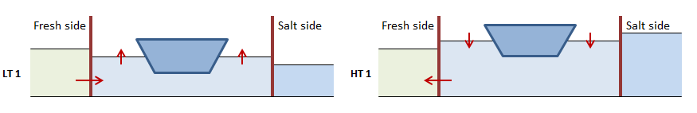
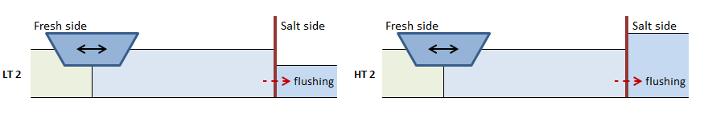
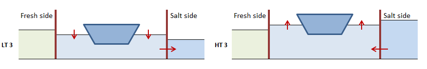
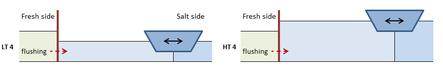

.. _chapter_eq_per_lock_phase:

Equations per locking phase
===========================

Below we discuss, per locking phase, the equations for the mass transport of salt, expressed in terms of volumes with certain salinity.
Eventually the transports over the entire locking cycle can then be determined by aggregating the transports per phase.

Because we assume cyclic operation of the lock, the initial condition of the lock (e.g. salinity) are equal to the conditions at the end of the cycle.

Phase 1: Leveling to fresh side
-------------------------------

The leveling takes place on the fresh-side head.
There are no transports over the sea-side head.

   Schematic overview of leveling to the fresh side during low and high tide

The salt transport due to leveling at low tide (LT) can be described as:

.. math::
    :label: eqphase_1_lt_mass

    LT: M_{F,LT1} = V_{level,LT} S_F

Similarly for high tide:

.. math::
    :label: eqphase_1_ht_mass

    HT: M_{F,HT1} = -V_{level,HT} S_{L,S}

By definition (see :eq:`calctransvol_level_definitions_lt` and :eq:`calctransvol_level_definitions_ht`) either :math:`V_{level,LT}` or :math:`V_{level,HT}` is zero, we can sum them up into one single equation:

.. math::
    :label: eqphase_1_mass

    M_{F,1} = V_{level,LT} S_F - V_{level,HT} S_{L,S}

When leveling at low tide, the average salinity of the water in lock chamber drops because fresh water is let in.
To calculate this new salinity, we have to take into account the water displacement of ships present in the lock chamber:

.. math::
    :label: eqphase_1_lt_sal_after_level

    LT: S_{L,S,Lev} = \frac{ S_{L,S} \left( V_{L,S}-V_{Ship,Up} \right) + S_F V_{Lev,LT}} {V_{L,F} - V_{Ship,Up}}

In the situation around high tide, water is extracted from the lock chamber to lower the level, which does not change the salinity of the lock chamber:

.. math::
    :label: eqphase_1_ht_sal_after_level

    HT: S_{L,F,Lev} = S_{L,S}

With this, we can write :eq:`eqphase_1_mass` as follows:

.. math::
    :label: eqphase_1_mass_alternate

    M_{F,1} = V_{level,LT} S_F - V_{level,HT} S_{L,S,Lev}

(The salinity in the lock chamber after Phase 1, :math:`S_{L,S,Lev}` can also be written as :math:`S_{L,1}`.)

The phase-averaged discharges to and withdrawals from the fresh side are then as follows (note that there are no flows on the salt side):

- withdrawal from the fresh side, with the prevailing salinity :math:`S_F`:

.. math::
    :label: eqphase_1_vol_withdrawn

    V_{F,1}^- = V_{Lev,LT}

.. math::
    :label: eqphase_1_flow_withdrawn

    Q_{F,1}^- = \frac{V_{F,1}^-}{T_{Lev}}

- discharge to the fresh side with salinity :math:`S_{L,S}`:

.. math::
    :label: eqphase_1_vol_discharged

    V_{F,1}^+ = V_{Lev,HT}

.. math::
    :label: eqphase_1_flow_discharged

    Q_{F,1}^+ = \frac{V_{F,1}^+}{T_{Lev}}

.. _sec_eqphase_phase2:

Phase 2: Door open on fresh side
--------------------------------

The figure below illustrates that in principle there are no differences between low tide and high tide.
In case of flushing through the lock, there is also a transport over the sea-side head.

   Schematic overview of flows when door is open on the fresh side during low and high tide

While the doors are open on one side there are various processes that take place that contribute to the transport of salt over the opened lock head.
These processes are:

    1. Salt transport due to ships exiting the lock chamber
    2. Salt transports due to the lock exchange (with or without flushing)
    3. Salt transport due to ships entering the lock chamber

If the transports due to these processes are independently calculated before adding them up, there is a possibility of the salt transport being too high.
This would result in a salinity in the lock chamber that is lower than the fresh side, or higher than the salt side.
To prevent this from happening, Phase 2 has been divided into three subphases, corresponding to the list above.
Each of these subphases leads to a new intermediate salinity of the lock chamber:

1: Salt transport due to ships exiting the lock

.. math::
    :label: eqphase_2_subphase_1_mass

    M_{F,2a} = V_{Ship,Up} S_F

.. math::
    :label: eqphase_2_subphase_1_sal

    S_{L,2a} = \frac{ S_{L,S,Lev} \left( V_{L,F} - V_{Ship,Up} \right) + M_{F,2a} }{ V_{L,F} }

2. Salt transport due to lock exchange (with or without flushing)

Contribution of lock exchange:

.. math::
    :label: eqphase_2_subphase_2_mass_le

    M_{F,2b,LE} = V_{U,F} S_F - V_{U,F} S_{L,2a}

With :math:`V_{U,F}` as determined in :eq:`flushing_superpos_lake_volume_le`.

Contribution of flushing over fresh-side head:

.. math::
    :label: eqphase_2_subphase_2_fresh_side_vol_flush

    V_{flush} = Q_{flush} T_{open,F}

.. math::
    :label: eqphase_2_subphase_2_fresh_side_mass_flush

    M_{F,2b,flush} = V_{flush} S_F

Contribution of flushing over the salt-side head.
When flushing for such a long time that the lock chamber's salinity reaches that of the fresh side, the salinity of the water going to the sea side changes accordingly:

.. math::
    :label: eqphase_2_subphase_2_salt_side_vol_flush

    V_{flush,max} = V_{L,F} - V_{U,F}

.. math::
    :label: eqphase_2_subphase_2_salt_side_mass_flush

    M_{S,2b,flush} = min \left( V_{flush}, V_{flush,max} \right) S_{L,2a} + max \left( V_{flush}-V_{flush,max},0 \right) S_F

The new salinity at the end of this subphase then is:

.. math::
    :label: eqphase_2_subphase_2_sal

    S_{L,2b} = \frac{ S_{L,2a} V_{L,F} + M_{F,2b,LE} + M_{F,2b,flush} - M_{Z,2b,flush} }{ V_{L,F} }

3. Salt transport due to ships entering the lock

.. math::
    :label: eqphase_2_subphase_3_mass

    M_{F,2c} = -V_{Ship,Down} S_{L,2b}

Phase 2: Total transports
-------------------------

The total transport of salt over the fresh-side head in this Phase is the sum of the transports of each subphase:

.. math::
    :label: eqphase_2_mass_fresh_side

    M_{F,2} = M_{F,2a} + M_{F,2b,flush} + M_{F,2b,LE} + M_{F,2c}

In case of a non-zero flushing discharge, there is also a transport over the salt-side head:

.. math::
    :label: eqphase_2_mass_salt_side

    M_{S,2}=M_{S,2b,flush}

The resulting salinity in the lock is then:

.. math::
    :label: eqphase_2_sal

    S_{L,F} = \frac{ S_{L,S,Lev} \left( V_{L,F} - V_{Ship,Up} \right) + M_{M,2} - M_{S,2} }{ \left( V_{L,F} - V_{Ship,Down} \right) }

(The salinity in the lock after Phase 2, :math:`S_{L,F}`, can also be written as :math:`S_{L,2}`.)

The phase-averaged discharges to and withdrawals from the fresh and salt side are then as follows:

- withdrawal from the fresh side, with the prevailing salinity :math:`S_F`:

.. math::
    :label: eqphase_2_vol_withdrawn_fresh_side

    V_{F,2}^- = V_{Ship,Up} + V_{U,F} + V_{flush}

.. math::
    :label: eqphase_2_flow_withdrawn_fresh_side

    Q_{F,2}^- = \frac{ V_{F,2}^- }{ T_{open,F} }

- discharge to the fresh side with salinity :math:`S_{F,2}^+`:

.. math::
    :label: eqphase_2_vol_discharged_fresh_side

    V_{F,2}^+ = V_{Ship,Down} + V_{U,F}

.. math::
    :label: eqphase_2_flow_discharged_fresh_side

    Q_{F,2}^+ = \frac{ V_{F,2}^+ }{ T_{open,F} }

.. math::
    :label: eqphase_2_sal_discharged_fresh_side

    S_{F,2}^+ = -\frac{ M_{F,2} - V_{F,2}^- \cdot S_F }{ V_{F,2}^+ }

- there is no withdrawal from the salt side in this Phase

- discharge to the salt side with average salinity :math:`S_S^+`

.. math::
    :label: eqphase_2_vol_discharged_salt_side

    V_{S,2}^+ = Q_{flush} T_{open,F}

.. math::
    :label: eqphase_2_flow_discharged_salt_side

    Q_{S,2}^+ = Q_{flush}

.. math::
    :label: eqphase_2_sal_discharged_salt_side

    S_{S,2}^+ = \frac{ M_{S,2} }{ V_{S,2}^+ }

Phase 3: Leveling to salt side
------------------------------

The leveling takes place on the sea-side head.
There are no transports over the fresh-side head.

   Schematic overview of leveling to the salt side during low and high tide

Just like in Phase LT 1 and HT 1 it holds that by definition either :math:`V_{level,LT}` or :math:`V_{level,HT}` is zero.
Therefore we can sum the equations for both tidal phases up into a single one:

.. math::
    :label: eqphase_3_mass

    M_{F,3} = V_{level,LT} S_{L,F} - V_{level,HT} S_{S}

In the situation around low tide, water is extracted from the lock chamber to lower the level, which does not change the salinity of the lock chamber:

.. math::
    :label: eqphase_3_lt_sal_after_level

    LT: S_{L,F,Lev} = S_{L,F}

When leveling at high tide, the average salinity of the water in lock chamber rises because salt water is let in.
To calculate this new salinity, we have to take into account the water displacement of ships present in the lock chamber:

.. math::
    :label: eqphase_3_ht_sal_after_level

    HT: S_{L,F,Lev} = \frac{ S_{L,F} \left( V_{L,F}-V_{Ship,Down} \right) + S_S V_{Lev,HT}} { V_{L,S} - V_{Ship,Down}}

With this, we can write :eq:`eqphase_3_mass` as follows:

.. math::
    :label: eqphase_3_mass_alternate

    M_{S,3} = V_{level,LT} S_{L,F,Lev} - V_{level,HT} S_S

(The salinity in the lock chamber after Phase 3, :math:`S_{L,F,Lev}` can also be written as :math:`S_{L,3}`.)

The phase-averaged discharges to and withdrawals from the salt side are then as follows (note that there are no flows on the fresh side):

- withdrawal from the salt side, with the prevailing salinity :math:`S_S`:

.. math::
    :label: eqphase_3_vol_withdrawn

    V_{S,3}^- = V_{Lev,HT}

.. math::
    :label: eqphase_3_flow_withdrawn

    Q_{S,3}^- = \frac{V_{S,3}^-}{T_{Lev}}

- discharge to the salt side with salinity :math:`S_{L,F}`:

.. math::
    :label: eqphase_3_vol_discharged

    V_{S,3}^+ = V_{Lev,LT}

.. math::
    :label: eqphase_3_flow_discharged

    Q_{S,3}^+ = \frac{V_{S,3}^+}{T_{Lev}}

Phase 4: Door open on salt side
-------------------------------

The figure below illustrates that in principle there are no differences between low tide and high tide.
In case of flushing through the lock, there is also a transport over the fresh-side head.

   Schematic overview of flows when door is open on the salt side during low and high tide

While the doors are open on one side there are various processes that take place that contribute to the transport of salt over the opened lock head.
These processes are:

    1. Salt transport due to ships exiting the lock chamber
    2. Salt transports due to the lock exchange (with or without flushing)
    3. Salt transport due to ships entering the lock chamber

If the transports due to these processes are independently calculated before adding them up, there is a possibility of the salt transport being too high.
This would result in a salinity in the lock chamber that is lower than the fresh side, or higher than the salt side.
To prevent this from happening, Phase 4 (just like Phase 2) has been divided into three subphases, corresponding to the list above.
Each of these subphases leads to a new intermediate salinity of the lock chamber:

1: Salt transport due to ships exiting the lock

.. math::
    :label: eqphase_4_subphase_1_mass

    M_{S,4a} = -V_{Ship,Down} S_S

.. math::
    :label: eqphase_4_subphase_1_sal

    S_{L,4a} = \frac{ S_{L,F,Lev} \left( V_{L,S} - V_{Ship,Down} \right) + M_{S,4a} }{ V_{L,S} }

2. Salt transport due to lock exchange (with or without flushing)

Contribution of lock exchange:

.. math::
    :label: eqphase_4_subphase_2_mass_le

    M_{S,4b,LE} = V_{U,S} S_{L,4a} - V_{U,S} S_S

With :math:`V_{U,S}` as determined in :eq:`flushing_superpos_salt_side_vol_u`.

Contribution of flushing over fresh-side head:

.. math::
    :label: eqphase_4_subphase_2_fresh_side_vol_flush

    V_{flush} = Q_{flush} T_{open,S}

.. math::
    :label: eqphase_4_subphase_2_fresh_side_mass_flush

    M_{F,4b,flush} = V_{flush} S_F

Contribution of flushing over the salt-side head.
When flushing for a long, an equilibrium situation arises as described in :numref:`sec_procdef_flushing_salt_side`. Furthermore, the salinity of the flushing discharge going to the salt side changes from that of the (initial salinity of the) lock chamber to that of the fresh side.

.. math::
    :label: eqphase_4_subphase_2_salt_side_vol_flush

    V_{flush,max} = V_{L,S} - V_{U,S}

.. math::
    :label: eqphase_4_subphase_2_salt_side_mass_flush

    M_{S,4b,flush} = min \left( V_{flush}, V_{flush,max} \right) S_{L,4a} + max \left( V_{flush}-V_{flush,max},0 \right) S_F

The new salinity at the end of this subphase then is:

.. math::
    :label: eqphase_4_subphase_2_sal

    S_{L,4b} = \frac{ S_{L,4a} V_{L,S} + M_{S,4b,LE} + M_{F,4b,flush} - M_{Z,4b,flush} }{ V_{L,S} }

3. Salt transport due to ships entering the lock

.. math::
    :label: eqphase_4_subphase_3_mass

    M_{S,4c} = V_{Ship,Up} S_{L,4b}

Phase 4: Total transports
-------------------------

The total transport of salt over the salt-side head in this Phase is the sum of the transports of each subphase:

.. math::
    :label: eqphase_4_mass_salt_side

    M_{S,4} = M_{S,4a} + M_{S,4b,flush} + M_{S,4b,LE} + M_{S,4c}

In case of a non-zero flushing discharge, there is also a transport over the fresh-side head:

.. math::
    :label: eqphase_4_mass_fresh_side

    M_{F,4} = M_{F,4b,flush}

The resulting salinity in the lock is then:

.. math::
    :label: eqphase_4_sal

    S_{L,S} = \frac{ S_{L,F,Lev} \left( V_{L,S} - V_{Ship,Down} \right) + M_{M,4} - M_{S,4} }{ \left( V_{L,S} - V_{Ship,Up} \right) }

(The salinity in the lock after Phase 4, :math:`S_{L,S}`, can also be written as :math:`S_{L,4}`.)

The phase-averaged discharges to and withdrawals from the fresh and salt side are then as follows:

- withdrawal from the salt side, with the prevailing salinity :math:`S_S`:

.. math::
    :label: eqphase_4_vol_withdrawn_salt_side

    V_{S,4}^- = V_{Ship,Down} + V_{U,S}

.. math::
    :label: eqphase_4_flow_withdrawn_salt_side

    Q_{S,4}^- = \frac{ V_{S,4}^- }{ T_{open,S} }

- discharge to the salt side with salinity :math:`S_{S,4}^+`:

.. math::
    :label: eqphase_4_vol_discharged_salt_side

    V_{S,4}^+ = V_{Ship,Up} + V_{U,S} + V_{flush}

.. math::
    :label: eqphase_4_flow_discharged_salt_side

    Q_{S,4}^+ = \frac{ V_{S,4}^+ }{ T_{open,S} }

.. math::
    :label: eqphase_4_sal_discharged_salt_side

    S_{S,4}^+ = \frac{ M_{S,4} - V_{S,4}^- \cdot S_S }{ V_{S,4}^+ }

- withdrawal from the fresh side, with the prevailing salinity :math:`S_F`:

.. math::
    :label: eqphase_4_vol_withdrawn_fresh_side

    V_{F,4}^- = Q_{flush} T_{open,S}

.. math::
    :label: eqphase_4_flow_withdrawn_fresh_side

    Q_{F,4}^- = Q_{flush}

- there is no discharge to the lake side in this Phase
