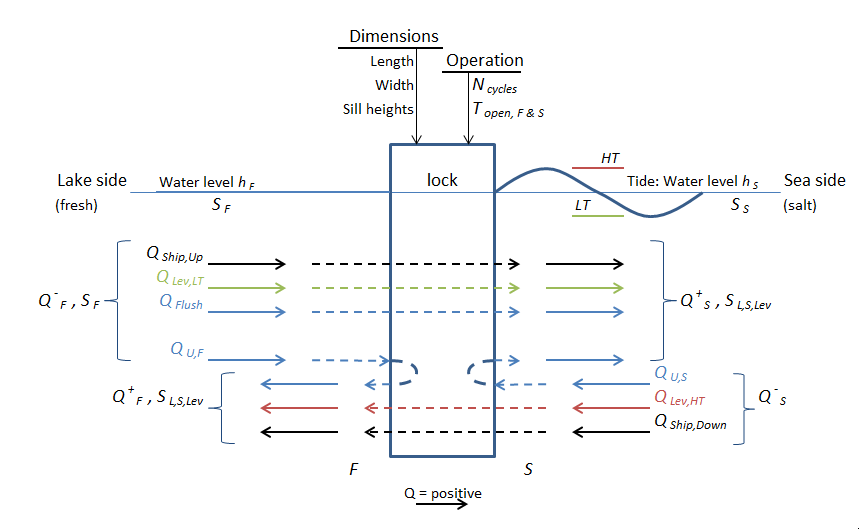

Introduction
============

Motivation and goals
--------------------

The Directorate-General for Public Works and Water Management (Dutch: Rijkswaterstaat), but also other private and public parties around the world in charge of water reserves, would like to calculate the influence of the salt intrusion through shipping locks on the salinity of the fresh water at a reasonable distance from the lock.
For example, to calculate the salinity of the water that farmers use to irrigate their land.
Such calculations should be able to consider a long period of time and area, as the spread and build-up of salt can take months or years.
It is also necessary to be able to consider multiple economical- and climate scenarios, along with the possible measures both on the shipping lock itself and those elsewhere in the system.
For this reason, there is a need to have a fast and compact formulation of the processes on the lock, such that this formulation can be used inside a far-field model that models the spread.
Such a formulation can then also be used to calculate the transport of water and salt through a shipping lock in a stand-alone fashion (i.e. without coupling it to- or incorporating it in a far-field model).

Approach
--------

The chosen approach for the ZSF is to set up the equations that describe the flows into and out of the lock, for all phases of the locking cycle.
Concretely, this means the volumes due leveling, the lock exchange process, ship displacement, and flushing discharges through the lock chamber.
Note that this phase-wise approach is opposed to a fixed time-step approach.

In case registrations of the door movements are available, one can calculate per locking phase what the transports of water and salt are in that particular phase over both lock heads (salt side and fresh side).
That way one can calculate based on historical registrations what the salt transport has been.

When no registrations are available, a cycle-averaged transport of salt and water can be calculated based on a few key parameters of the lock operation.
These parameters are then translated into a repeating pattern of locking phases, i.e. when the door is open and how long leveling is supposed to take.
Then, the transports of water and salt per phase can be added up, leading to cycle-averaged values of the transports.
These averaged values can then serve as in a forcing in a far-field model.

An overview of the concept of the ZSF model is given in figure below.
A more detailed discussion of all the physical quantities involved will be explained later.
What is visible is that the boundary conditions of the model are the temperature, salinity and water level on each side of the lock.
These boundary conditions, together with the geometry and operation of the lock, determine the discharge that go into the lock with the governing salinity, and out of the lock with a salinity in the lock chamber that follows from the locking process.
The flows into the lock chamber are a withdrawal from the approach harbor on each side of the lock, :math:`Q^-_F` and :math:`Q^-_S`, and the flows going out of the lock are discharges to the approach harbors, :math:`Q^+_F` and :math:`Q^+_S`.

   Schematic overview of the model concept: discharges going in and out on both sides of the lock, with their corresponding salinities.
