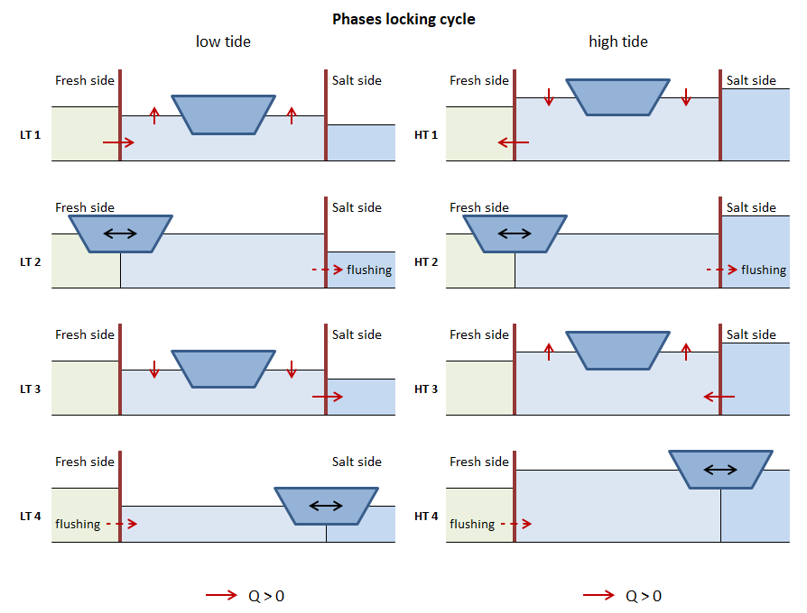
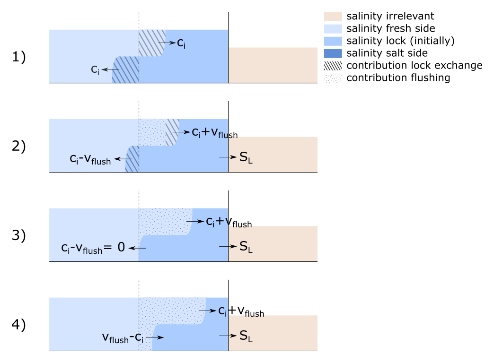
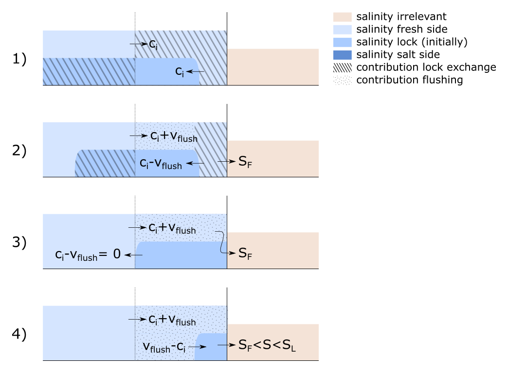
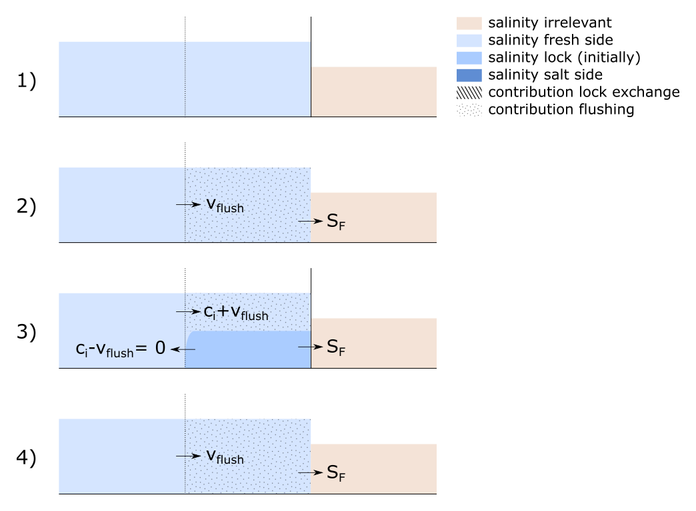
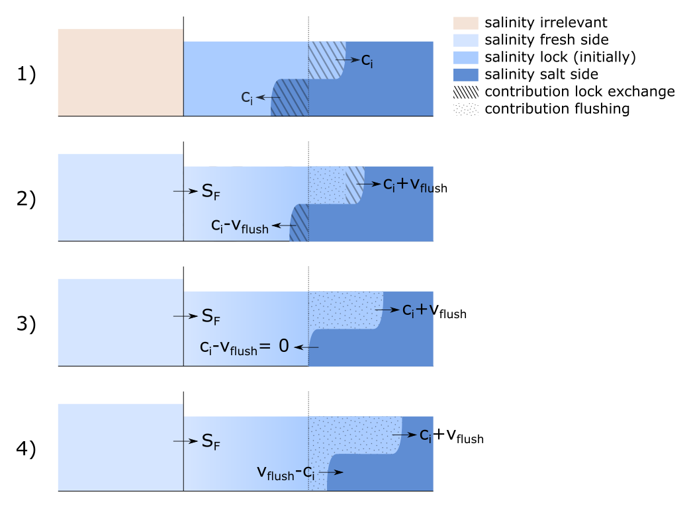
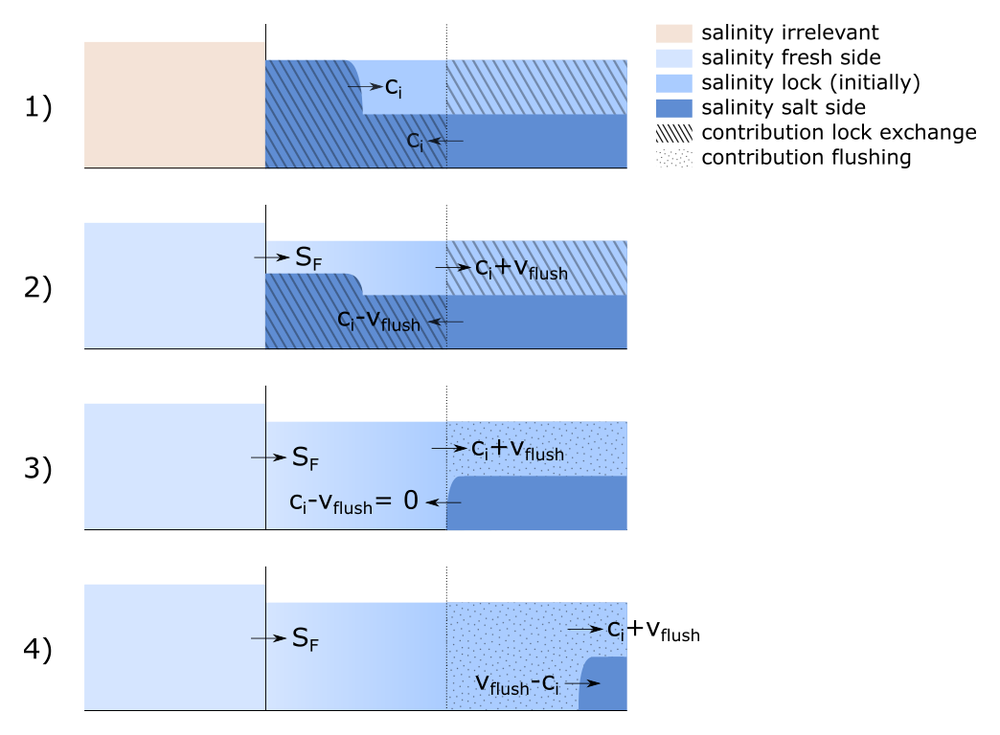
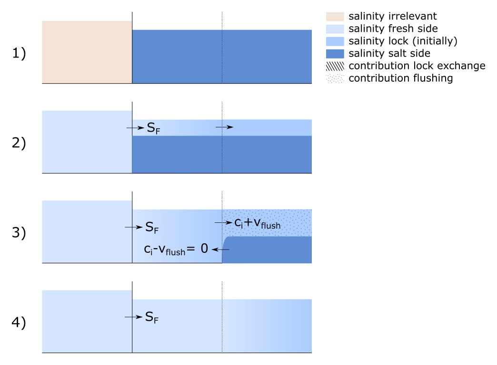

.. _sec_procdef:

Processes and definitions
=========================

To set up the equations, it is necessary to define the various physical quantities.
An understanding of these physical quantities should be based on an understanding of the relevant processes.
Therefore, we first (briefly) introduce these processes, followed by explaining the quantities that will appear in the equations later on.

Processes in the locking cycle
------------------------------

Leveling
^^^^^^^^

The locking of ships is in essence about overcoming a difference in water level.
By letting a ship moore temporarily in a lock chamber, and by changing the water level in this lock chamber, the water level difference can be bridged.
This process is called leveling.
Raising the water level is done by letting water from the high side ('filling'), and lowering the water level is done by letting out water to the low side ('emptying').

Lock exchange
^^^^^^^^^^^^^

Where there is a difference in salinity - and with that a difference in density - between both sides of the lock, a current will start to develop when the doors on either end are opened.
This current is called a density current, and the phenomenon of this current exchanging the salt water in the lock chamber with fresh water (or vice versa) is called 'lock exchange'.
The less dense fresh water will start to float on top of the denser salt water, and move to the salt side.
After reflection of the density current on the closed doors, the process continuous until just about the entire lock volume has been exchanged or until the doors are closed.

Locking operation
^^^^^^^^^^^^^^^^^

The locking operation concerns the opening and closing of doors on one side, leveling, the opening and closing of the doors on the other side, and leveling back again.
When the doors open, ships will leave the lock chamber, before new ones going the opposite direction enter the lock chamber and the doors close again.
The discharge through the lock due to leveling is determined by the surface area of the lock chamber, the water level difference, and the number of locking cycles per unit of time.
For the lock exchange process, it is the time that the doors are open that matters.
The time that the doors are open determines whether the density current partially or fully exchanges the water in the lock chamber.

Shipping
^^^^^^^^

The presence of ships in the locking cycle influences the lock exchange in two ways:

1. When a ship enters a lock chamber, water is pushed out of said lock chamber.
   The amount of water that leaves the lock is equal to the water displacement of the ship.
   Conversely, when ships exit the lock chamber, water will flow from the approach harbor into the lock chamber to fill the 'hole' left by the ships.
2. The upwards leveling of a lock chamber means that water comes in from the high side.
   In case of a lock between salt- and fresh water, it is likely that the water that enters has a different salinity than the water inside the lock chamber.
   At the end of leveling the lock chamber will therefore have a new average salinity.
   When determining this average salinity we need to take into account that, when ships are present in the lock, there is less water inside the lock chamber.

The presence of ships inside the lock chamber does not have influence on the amount of water that is needed for leveling.

In the formulation of transports through the lock it is not about the individual but about the total water displacement of the ships per cycle.
This value can differ for both direction, upstream and downstream.
Do note that these two values do not have to be equal to each other.
For example, when through a certain lock more cargo is imported than exported, this will be represented accordingly in the water displacements in both directions.
With that, also a net discharge through the lock can arise.

Measures to prevent salt intrusion
^^^^^^^^^^^^^^^^^^^^^^^^^^^^^^^^^^

To reduce the salt intrusion through shipping locks, a number of measures are available.

Bubble screens
""""""""""""""

Bubble screen in the lock heads reduce the velocity of the density current while the doors are open.
It can therefore be an effective measure to reduce the salt intrusion, but the reduction also depends on limiting the amount of time the doors are open.

Flushing through the lock chamber
"""""""""""""""""""""""""""""""""

If the water level on the salt side is lower than that on the fresh side, the salt intrusion can be reduced by flushing the lock chamber with fresh water.
When the lock opens to the fresh side, the water inside the lock chamber will have a lower salinity.
This causes the density current velocity to drop, and also reduces the maximum amount of salt that can be transported due to lock exchange.
When flushing with doors open, the flushing discharge with also reduce the velocity of the density current by means of superposition of velocities.
Note that the same principle of flushing the lock can be applied when the water level on the salt side is higher, but pumps will be needed to realize the desired flushing discharge.

Conventions
-----------

For the positive direction of flows the dominant flow direction of the river or delta is chosen, i.e. downstream, towards the sea, from fresh to salt.
This is in line with the convention of other software and model schematizations.
Due to this choice, salt intrusion is a transport of salt in the negative direction.

This convention is also used in the figures in this documentation: a positive discharge means flow from left to right, with the upstream side on the left and the sea/salt side on the right.

Subscripts to denote the lock chamber, the fresh side, and the salt side are respectively :math:`L`, :math:`F`, and :math:`S`.

Phases of the locking cycle
---------------------------

In the figure below the different phases of the locking cycle are displayed and named.
Because the direction of the leveling depends on whether the water level on the salt or fresh side is higher, there is a high water and low water state.

The water levels (:math:`h`) on each side of the lock are defined as :math:`h_F` for the water level on the fresh side, and :math:`h_S` for the water level on the salt side.
From this the definition of the high and low water state follows:

- when :math:`h_S \lt h_F` the state is LW
- when :math:`h_S \ge h_F` the state is HW

   The phases of the locking cycle

In this figure the positive direction is shown for the discharge (:math:`Q`), but the same convention holds for the transported volume (:math:`V`) and transported salt mass (:math:`M`).

Physical quantities
-------------------

The transports through a lock are determined by four categories of physical quantities:

- The boundary conditions on either side of the lock
- The geometry of the lock
- The operation of the lock
- The dimensions of the ship(s)

The calculated transports are expressed in terms of a transported salt mass per unit of time (or locking cycle), determined by the transported volumes and their corresponding salinities.

Boundary conditions
^^^^^^^^^^^^^^^^^^^

The boundary conditions on either side of the lock, the fresh side and the salt side, consist of a water level with a corresponding salinity or density.
In stand-alone operation, these boundary conditions are prescribed by the user.
When part of a larger (far-field) model, said model will prescribe the boundary conditions to the ZSF.

:math:`h`: The water levels on each side of the lock in [mDAT]

    Suffix: :math:`L`, :math:`F`, and :math:`S` for the lock, fresh side and salt side.

:math:`S`: Salinity in [:math:`kg/m^3`]

    Suffix: :math:`L`, :math:`F`, and :math:`S` for the lock, fresh side and salt side.

    Second suffix for :math:`S_L`:

        :math:`F`: direction after closing the door on the fresh side

        :math:`S`: direction after closing the door on the salt side

    Third suffix for :math:`S_L` or :math:`S_S`:

        :math:`Lev`: after leveling, that follows on closing the door on the other side

:math:`\overline \rho`: The average density of the water on each side of the lock head in [:math:`kg/m^3`]

    These values are generally available from a far-field model.
    In stand-alone usage, the density is calculated from the salinity using the UNESCO-formulation.

:math:`\overline \rho_{FS}`: The average density of the water on the fresh and salt side in [:math:`kg/m^3`]

    These values are generally available from a far-field model.
    In stand-alone usage, the density is calculated from the salinity using the UNESCO-formulation.

Geometry
^^^^^^^^

The general geometric parameters of the lock are:

    :math:`L_L`: length of the lock chamber in [:math:`m`]

    :math:`W_L`: width of the lock chamber in [:math:`m`]

    :math:`z_L`: bottom depth of the lock chamber in [mDAT]

From these follow:

    :math:`H`: water level over the bottom of the lock chamber or lock head in [:math:`m`].

        .. math::
            :label: geometry_def_hf_hs

            H_F = h_F - z_L

            H_S = h_S - z_L

    :math:`V`: the volume of the lock chamber in [:math:`m^3`] at a certain water level

        .. math::
            :label: geometry_def_vlf_vls

            V_{L,F} = L_L W_L H_F

            V_{L,S} = L_L W_L H_S

Difference in the lock bottom layout inside and outside the lock chamber, combined with the possible presence of sills in the lock heads, will influence the lock exchange.
For the correct calculation thereof, additional parameters are necessary.
That is, it is necessary to define _effective_ values of length, depth and volume.
This is discussed in more detail in TODO_REFCHAP7.

If the lock bottom is equal throughout and there are no sills in the lock heads, it holds that:

    .. math::
        :label: geometry_eff_length

        L_{L,eff} = L_L

    and

    .. math::
        :label: geometry_eff_wls

        H_{F,eff} = H_F

        H_{S,eff} = H_S

    and

    .. math::
        :label: geometry_eff_volumes

        V_{L,F,eff} = V_{L,F}

        V_{L,S,eff} = V_{L,S}

Operation
^^^^^^^^^

    :math:`T_{in-use}`: hours per day that the lock is operational [hour]

        This is a constant with a value of 24 hours.

    :math:`N_{cycles}`: locking frequency [-]

        The number of locking cycles (back and forth) per day.

    :math:`T_{door}`: time needed to move (open or close) the doors [min]

    :math:`T_{level}`: the average time needed to level the lock [min]

Research has shown that a variation in locking frequency over the day or week influences the salt intrusion significantly.
To take this effect into account, two additional parameters are introduced:

    :math:`c_{dot}`: a calibration coefficient as a factor on the door-open time [-]

        Default value is 1 (conservative); the range is :math:`[0, 1]`

    :math:`C_{F/Avg}`: a symmetry coefficient indicating whether the doors are open equally long on both sides [-]

        Default is 1 (equally long). Range is 0 (door on fresh side effectively never open) to 2 (door on salt side effectively never open).

From these parameters follow:

    :math:`T_{cycle}`: the average time for a complete locking cycle [s]

        .. math::
            :label: operation_parameters_t_cycle

            T_{cycle} = \frac{T_{in-use} \cdot 60 \cdot 60}{N_{cycles}}

    :math:`T_{open,avg}`: the average door-open time [s]

        .. math::
            :label: operation_parameters_t_open_avg

            T_{open,avg} = \frac{1}{2} T_{cycle} - \left( T_{level} + \frac{2}{2} T_{door} \right) \cdot 60

        Do note that for the calculation of the door-open time we subtract twice half the time it takes to open- or close the door.
        That means that effectively we assume that the lock-exchange process starts and ends when the doors are opened/closed halfway.

    :math:`T_{open}`: the representative door-open time [s]

        .. math::
            :label: operation_parameters_t_open

            T_{open} = c_{dot} T_{open,avg}

    :math:`T_{open,F}` and :math:`T_{open,S}`: the representative door-open times on the fresh and salt side [s]

        .. math::
            :label: operation_parameters_t_open_f_s

            T_{open,F} = c_{F/Avg} T_{open}

            T_{open,S} = \left( 2 - c_{F/Avg} \right) T_{open}

Transports
^^^^^^^^^^

    :math:`M` The amount of transported salt [kg] per locking phase (over a certain head)

        first suffix: :math:`F`, and :math:`S` for the lock head on the fresh side or salt side.

        second suffix: :math:`LT1` - :math:`LT4`: phase of the locking cycle, simplified to just `1-4` if the formula is equal for both tidal phases.

    :math:`V` a volume of water with salt that is moved between lock and approach harbor [:math:`m^3`]

        suffixes:

            :math:`Lev`: due to leveling

                followed by either `LT` or `HT`, depending on the direction of the head difference over the lock

            :math:`U`: due to lock exchange

                followed by :math:`F`, and :math:`S` for fresh side or salt side

            :math:`Ship`: the total water displacement of the ships

                Up: For ships moving in upstream direction, i.e. from salt to fresh side

                Down: For ships moving in downstream direction, i.e. from fresh to salt side

            :math:`Flush`: Due to a flushing discharge through the locking chamber

                followed by either `LT` or `HT`, depending on the direction of the head difference over the lock

Calculation of the transported volumes
--------------------------------------

Leveling volume
^^^^^^^^^^^^^^^

The leveling volume plays a.o. a role in filling the lock chamber.
Note that when filling the lock chamber, the salinity in the lock chamber changes.
When emptying (i.e. leveling to the side with lower level), the salinity in the lock does not change.

Because the expression for filling and emptying are different, the formulas are separated.
In addition, it is convenient to have different identifiers for both tidal phases.

.. math::
    :label: calctransvol_level_definitions_lt

    LT: V_{level,LT} =  L_L W_L \left( h_F - h_S \right), V_{level,HT} = 0

.. math::
    :label: calctransvol_level_definitions_ht

    HT: V_{level,LT} = 0, V_{level,HT} = L_L W_L \left( h_S - h_F \right)

.. _sec_procdef_lockexch:

Lock exchange
^^^^^^^^^^^^^

The lock exchange is often the most import process for lock intrusion through shipping locks.
The process of lock exchange in time can be approximated with a hyperbolic tangent function.
With that, the exchange volume :math:`U (= V_U / V_K)`, slowly goes to 1 when the doors stay open for a long period of time.

.. math::
    :label: calctransvol_lockexch_definition_vu

    V_U = V_L U = V_L \tanh \left( \frac{T_{open}}{T_{LE}} \right)

The door-open time :math:`T_{open}` is in this expression compared to the (theoretical) time it takes for the density current to travel twice the length of the lock chamber.

The (initial) velocity of the density current :math:`c_i` is determined by the relative density difference :math:`\Delta \rho / \overline \rho` and the water level in the respective head :math:`H`

.. math::
    :label: calctransvol_lockexch_definition_ci

    c_i = \frac{1}{2} \sqrt{g' H} = \frac{1}{2} \sqrt{g \frac{\Delta \rho}{\overline \rho} H} \approx \frac{1}{2} \sqrt{g 0.8 \frac{\Delta S}{\overline \rho_{FS}} H}

The difference in density can be approximated as 0.8 times the difference in salinity (in :math:`kg/m^3`) between the lock and the approach harbor.
For :math:`\overline \rho` a value could be deduced from both sides of the lock head at time of opening.
Using a fixed value based on the boundary conditions (the average density over the lock :math:`\overline \rho_{FS}`) introduces only a small approximation error.

With this density current velocity, :math:`T_{LE}` can be defined as:

.. math::
    :label: calctransvol_lockexch_definition_tle

    T_{LE} = \frac{2L}{c_i} = \frac{4L}{\sqrt{g\frac{0.8 \Delta S}{\overline \rho_{FS}} H}}

The presence of sills and levels difference on the bottom of the lock chamber can influence the lock exchange.
In this case, the values for the length, volume and water level depth will need to be adjusted.

Bubble screens
^^^^^^^^^^^^^^

The effectiveness of a bubble screen is often expressed as a factor on the velocity of the density current :math:`\eta`.
This density-current factor is a number in the interval [0, 1], the more effective a bubble screen the lower this value is (with a limit of about 0.2 - 0.25).
With the velocity of the density current decreasing, the time it takes for a complete lock exchange increases.
The factor can then be easily introduced in equation :eq:`calctransvol_lockexch_definition_vu` describing the amount of volume exchanged due to lock exchange:

.. math::
    :label: calctransvol_lockexch_definition_vu_eta

    V_U = V_L U = V_L \tanh \left( \frac{\eta T_{open}}{T_{LE}} \right)

.. note ::

    This way of introducing :math:`\eta` is elegant, but does imply that the only the velocity of the density current is changed, and e.g. the salinity of the density current is not.
    In reality the bubble screen will cause a lot of mixing to occur, and therewith the salinities of lock exchange to change.

Flushing discharge
------------------

A flushing discharge always goes from the fresh to the salt side.
Such a discharge would generally only be possible in case of low-tide.
In the high-tide case, a pump would be needed, and therefore the flushing discharge at high tide is often zero in practice.
From an operational standpoint, there is a certain maximum instantaneous discharge.
This is the discharge that is acceptable for the safe and speedy entry and exit of ships from the lock chamber.
This momentaneous value (to be distinguished from the cycle-averaged discharge) is input by the user, with separate values for LT and HT.

.. math::
    :label: flushing_definition_discharge_lt

    LT: Q_{flush} =  Q_{flush,LT}

.. math::
    :label: flushing_definition_discharge_ht

    HT: Q_{flush} =  Q_{flush,HT}

In many cases there is only a discharge when either lock head is open.
It is also possible to flush with both lock heads closed, but the leveling system still open.
For now, we will assume the latter does not happen.
That assumption then leads to the following equation for the flushed volume:

.. math::
    :label: flushing_definition_volume

    V_{flush} = Q_{flush} \left( T_{open,F} + T_{open,S} \right)

In practice, flushing is temporarily stopped when ships are sailing in from the fresh side to let them safely moor.
This distinction cannot be made in the ZSF, so flushing will happen for the entire door-open time.

The flushing discharge interacts with the density current and ships.
For now, we will neglect the interaction of the flushing discharge and density current with the ships.
In other words, in the discussion below, we will assume that the lock chamber does not contain any ships.

Generally we can assume a simple superposition of velocities when considering the interaction between flushing and lock exchange.
This has consequences for the maximum exchangeable volume by the density current, which will discussed below in more detail using four scenario's.
These scenario's differ in the magnitude of the flushing velocity (relative to the velocity of the density current):

1. No flushing discharge

2. Velocity of the flushing discharge is lower than that of the density current: :math:`v_{flush} = 0.5 \cdot c_i`

3. Velocity of the flushing discharge is equal to that of the density current: :math:`v_{flush} = c_i`

4. Velocity of the flushing discharge is larger than that of the density current: :math:`v_{flush} = 1.5 \cdot c_i`

For every scenario we consider the entering (density) current, the reflecting, and the steady state condition at (infinitely) long door-open times.

Because the interaction between the flushing discharge and density current differs for the fresh side and salt side, they are discussed separately.

Flushing fresh side
^^^^^^^^^^^^^^^^^^^

Entering current
""""""""""""""""

   Schematic overview of the entering density current as a function of the flushing discharge

In Scenario 1 the lock exchange is displayed for when there is no flushing discharge, as described in :numref:`sec_procdef_lockexch`.
The water that is exchange between the lock and the fresh approach harbor can be fully attributed to the density current.

In Scenario 2 is visible what happens when there is a flushing discharge with a velocity lower than that of the density current.
The water from the lock chamber that enters the approach harbor can only get there because of the density current / lock exchange process.
There is an equally large contribution of lock exchange in the lock chamber itself, but another part of the fresh water that has entered is due to the flushing discharge.
In case of a flushing velocity of :math:`0.5 \cdot c_i` the ratio is 2/3 flushing discharge, and 1/3 lock exchange.

In Scenario 3 and 4 is visible what happens when the flushing velocity equals or exceeds the velocity of the density current.
In these cases, the density current cannot exit the lock chamber, and as such we can say that no lock exchange has happened.
The volume-averaged salinity of the lock chamber dropping can then be entirely attributed to the flushing discharge.

Reflecting current
""""""""""""""""""

   Schematic overview of the reflecting density current as a function of the flushing discharge

When there is flushing discharge as in Scenario 1, the pace of the fresh water displacing salt water in the lock chamber after reflection is equal to that of an entering current.
This holds when we assume velocities as shown in the figure above.
In :numref:`sec_procdef_lockexch` a hyperbolic-tangent approach was used, which implies that the velocity of the density current slowly (but steadily) decreases.

In Scenario 2 is visible what happens when there would a flushing discharge.
For an entering density current the water that goes to the salt side still has a salinity of :math:`S_L`.
That has now turned into water with salinity :math:`S_F`
This means that the pace of the lock chamber's salinity dropping in this phase scales with the velocity of the exiting density current, because all incoming flushing discharge with salinity :math:`S_F` will pass right through the lock chamber and exit to the salt side.
Contrary to Scenario 1, that means that the pace of the lock chamber's salinity dropping suddenly changes when the density current reflects.
After reflection, the lock chamber becomes fresh slower than for an entering density current.

For Scenario 3 we extrapolate from Scenario 2, and therefore assume that the water leaving the lock chamber on the salt-side head has a salinity of that of the fresh side.
For Scenario 4, a mixture of fresh water and water from the lock chamber exits to the salt side.
As such, the salinity of the water going to the salt side is somewhere between these two.

Final (steady) state
""""""""""""""""""""

   Schematic overview of the final state of the lock chamber as a function of the flushing discharge

In the hypothetical case that the door is opened infinitely long, the final state in the lock chamber is often a fully fresh one.
Only for Scenario 3 there would still be a salt bottom layer present.
This is because, based on superposition of velocities alone, this layer never moves.
In reality, mixing on the boundary layer between salt and fresh will slowly erode this bottom layer, such that also in this case a fully fresh lock chamber results.

Simplifications and formulation
"""""""""""""""""""""""""""""""

In previous sections was discussed how the entering and reflecting density current behave if we assume a superposition of velocities.
In :numref:`sec_procdef_lockexch` the lock exchange with flushing discharge is already written down in mathematical relations.
Whereas a single formulation could cover all defined scenario's for the entering density current, that is no longer possible when also having to take the reflecting density current or final state into account.
There would be an abrupt change in the pace with which the lock chamber's salinity drops, and also an abrupt change in the salinity of the flushing water going to the salt side.
Furthermore, in the above discussion mixing/erosion has not been taken into account, even though those would occur in reality.

To come to a simple formulation, we make the following assumptions:

- The final state is always a fully fresh lock chamber (like in Scenario 1, 2 and 4).
  With this assumption we are closer to reality than would be the case based on superposition of velocities alone.

- The initial pace of salinity change in the lock (for an entering density current) scales with the ratio with the flushing velocity.
  This pace is kept even when the density current reflects, and slowly goes to zero with a hyperbolic tangent just like in :numref:`sec_procdef_lockexch`.

- The pace of salinity change due to the flushing discharge is constant.
  In other words, the flushing water that enters the lock has a salinity of that of the fresh side, and the flushing water that exits has a salinity equal to that of the lock chamber when the doors opened.
  As soon as the lock is entirely fresh, flushing no longer has any effect on the salinity of the lock chamber, and as such we assume that the salinity of the water going to the salt side then switches to being equal to that of the fresh side (and equal to that of the lock chamber in that moment).

Written in equations, we see that the fraction of lock exchange in Scenario 2 scales linearly with the ratio of the flushing velocity to the velocity of the density current, until the situation of Scenario 3 is reached:

.. math::
    :label: flushing_superpos_lake_frac

    f_{LE,flush} = max \left( \frac{c_i - v_{flush}}{c_i}, 0 \right)

This leads to the following equation for the exchanged volume due to lock exchange (with :math:`V_U` as defined in :numref:`sec_procdef_lockexch`):

.. math::
    :label: flushing_superpos_lake_volume_le

    V_{U,F} = f_{LE,flush} V_U

With these simplifications the lock becomes fresher quicker than in reality, but there is also less salt going to the fresh side.
How conservative or optimistic this formulation then is (and with that the salt/fresh load), is unknown.
This is also mentioned as a point of attention in Section TODO.

For Scenario 2, 3 and 4 it holds that flushing displaces the following volume:

.. math::
    :label: flushing_superpos_lake_volume_flush

    V_{flush} = Q_{flush} T_{open,F}

The salinity of the flushing discharge is always :math:`S_F` over the fresh-side head.
The salinity of the flushing discharge over the salt-side head is initially :math:`S_L`, switching to :math:`S_F` as soon as the lock is fully fresh.
In Scenario 3 and 4, where contrary to Scenario 1 and 2 there is no contribution of the lock exchange to the salinity decrease, this switch happens as soon as :math:`V_{flush}` is equal to :math:`V_L`.

.. _sec_procdef_flushing_salt_side:

Flushing salt side
^^^^^^^^^^^^^^^^^^

When flushing with the door on the salt side opened, fresh water is entering the lock chamber from the fresh side.
Two extremes of that situation are shown in the figure below.
In reality, the distribution of the fresh water will be somewhere inbetween the extremes shown.
In addition, the boundary between the fresh water and the saltier water in the lock chamber will not be as sharp due to mixing.
As such, the water that goes to the the salt side will become fresh before the lock exchange process is done.

.. figure:: ../images/flushing_diagram_salt_side_alternatives.png

   Schematic overview of fresh flushing water entering the lock when salt-side door is open

In the discussion of the entering and reflecting density current below we neglect the effect the dilution of the lock chamber has on the velocity of said density current.

Entering current
""""""""""""""""

   Schematic overview of the entering density current as a function of the flushing discharge

In Scenario 1 in the figure above the situation is shown for a density current with no flushing discharge.
The water that is exchanged between the lock chamber and the salt approach harbor can be fully attributed to the density current, traversing with velocity :math:`c_i`.

In Scenario 2 is visible what happens when one flushes with a velocity lower than that of the density current.
The salty approach water that moves across the opened door into the lock chamber can only get there due to the lock exchange process / density current.
An equal amount of water from the lock chamber exits to the approach harbor by way of the density current.
The remainder of the lock chamber water that exits the lock is due to the flushing discharge.
An equal amount of fresh water enters the lock from the lake side through the closed doors.
That means the salinity in the lock is both increasing (near the sea side) and decreasing (near the fresh side).

In Scenario 3 and 4 is visible what happens when the velocity of the flushing discharge equals or surpasses that of the density current.
In this case, the density current is not able to enter the lock, and as such we can say that there is no lock exchange taking place.
There is however a dilution of the lock chamber, which can be fully attributed to the flushing discharge.

Reflecting current
""""""""""""""""""

   Schematic overview of the reflecting density current as a function of the flushing discharge

When there is no flushing discharge, the pace of salinization of the lock chamber is equal to that of an entering current, if we assume the velocities as shown in the figure above.
In :numref:`sec_procdef_lockexch` an approach with a hyperbolic tangent is described, which would mean that the pace of salinization would slowly but steadily drop.

In Scenario 2 is visible what happens when a flushing discharge is present.
The salt wedge still enters with the same velocity, but exiting wedge (top layer) should exit more quickly because it cannot take up the full (half) height.

In Scenario 3 and 4 the density current does not enter the lock.
In reality the density current will slowly start to enter the lock in Scenario 3, because the lock chamber is diluting and with that the driving density difference increases.
The salinity of the water that leaves the lock to the salt approach harbor in this phase is likely somewhere between that of the initial salinity of the lock chamber, and that of the fresh side.

Final (steady) state
""""""""""""""""""""

   Schematic overview of the final state of the lock chamber as a function of the flushing discharge

When the door on the sea side is open infinitely long, the equilibrium situation is dependent on the velocity of the flushing discharge.

In Scenario 1 the lock chamber will have acquired a salinity equal to that of the salt side.

In Scenario 2 a certain equilibrium between the driving salinity difference and flushing discharge is obtained.
Shown in the figure above we assume a sharp interface between the salt bottom layer and the fresh layer of flushing discharge.
In reality, instabilities on this interface will cause mixing, and this in turn will influence the lock exchange.

In Scenario 3 and 4 the lock chamber becomes fully fresh.
A nuance is that the driving salinity difference does increase with the lock chamber diluting, and with that a density current might start to enter the lock chamber eventually anyway.
That would then lead to an equilibrium state more equal to that of Scenario 2.

Simplifications and formulation
"""""""""""""""""""""""""""""""

In previous sections was discussed how the entering and reflecting density current behave if we assume a superposition of velocities.
In :numref:`sec_procdef_lockexch` the lock exchange with flushing discharge is already written down in mathematical relations.
Contrary to the discussion of the fresh side, there is now a clear distinction between the final steady state in Scenario 1 and 2 (lock chamber fully or just partially salinized), and Scenario 3 and 4 (lock chamber diluted to salinity of fresh side).
The formulation that is derived should therefore also make a distinction between these two.

Just like in the discussion for the fresh side, it is difficult to describe the transition from entering to reflecting density current.
This is further complicated by the slow dilution of the lock chamber with fresh water, where it is not known how and where this water mixes with that of the lock chamber (i.e. does the fresh water float to the top, or does the entire lock chamber dilute more uniformly).

To come to a simple formulation, we make the following assumptions:

- The height of the top layer that forms in Scenario 2 is a function of the density difference between the salt side and the fresh side, and the flushing discharge.
  The higher the flushing discharge the thicker this layer of fresh water in the lock chamber.
  The higher the density difference, the thinner this layer is.

- In Scenario 1 and 2 we use the behavior as discussed in :numref:`sec_procdef_lockexch`, where the pace of the lock exchange steadily decreases.
  The initial velocity of the density current is :math:`c_i - v_{flush}`, and the maximum volume that can be exchanged is only part of the volume of the lock chamber (as discussed in the previous assumption).
  That is, the maximum exchangeable volume is :math:`V_L - V_{top-layer}`.

- In Scenario 3 and 4 the lock chamber the salt density current will never enter the lock chamber.
  The pace of dilution due to the flushing discharge is assumed constant.
  In other words, the water that enters the lock has a salinity of that of the fresh side, and the water that exits has a salinity equal to the initial (at time of opening of the doors) salinity of the lock chamber.
  As soon as the lock chamber has been fully diluted, the salinity of the water that exits switches to that of the fresh side (equal to the lock chamber at that point in time).

For Scenario 1 we can then use the formulation of :numref:`sec_procdef_lockexch` as-is, or the below formulation for Scenario 2 with the height of the top layer equal to zero.
For Scenario 2 it holds that we can solve for the thickness of the top layer by rewriting :eq:`calctransvol_lockexch_definition_ci`, and setting :math:`c_i` equal to the velocity of the water in the top layer :math:`v_{top-layer}`.

.. math::
    :label: flushing_superpos_salt_side_h_eq

    H_{eq} = 0.5 \frac{ \left(2 \cdot v_{top-layer} \right) ^ 2 \cdot \overline \rho_{FS}}{g \cdot 0.8 \left( S_S - S_F \right)}

.. math::
    :label: flushing_superpos_salt_side_v_toplayer

    v_{top-layer} = \frac{ Q_{flush} }{ H_{eq} \cdot W_L }

To make the process of rewriting easier to understand, we merge all fixed terms into one constant:

.. math::
    :label: flushing_superpos_salt_side_constant_terms

    C = \frac{ \overline \rho_{FS} }{ g \cdot 0.8 \left( S_S - S_F \right) }

We can then write :math:`H_{eq}` as a function of itself:

.. math::
    :label: flushing_superpos_salt_side_h_eq_itself

    H_{eq} = 2 \frac{ Q_{flush}^2 }{ H_{eq} ^ 2 W_L ^ 2 } \cdot C

The last step is to make this height explicit:

.. math::
    :label: flushing_superpos_salt_side_h_eq_explicit

    H_{eq} = \left( 2 \cdot \frac{Q_{flush}^2}{W_L^2} \cdot C \right) ^ \frac{1}{3}

With that, the maximum volume that can be exchanged by the density current then is:

.. math::
    :label: flushing_superpos_salt_side_frac_flush

    f_{LE,flush} = \frac{H_S - H_{eq}}{H_S}

The time :math:`T_{LE}` that it takes to exchange this volume is defined as follows:

.. math::
    :label: flushing_superpos_salt_side_t_le

    T_{LE,S} = \frac{2 \cdot f_{LE,flush} \cdot L_L}{\eta c_i - v_{flush}}

This leads to the following equation for the exchanged volume by the density current:

.. math::
    :label: flushing_superpos_salt_side_vol_u

    V_{U,S} = f_{LE,flush}V_{L,S} \tanh \left( \frac{T_{open}}{T_{LE,S}} \right)

For Scenario 2 - 4 it holds that the flushing discharge displaces the following volume:

.. math::
    :label: flushing_superpos_salt_side_vol_flush

    V_{flush} = Q_{flush} T_{open,S}

The salinity of this discharge is always :math:`S_F` over the fresh-side head, i.e. when it enters the lock chamber.
For the sea-side lock head, the salinity is initially :math:`S_L`, switching to :math:`S_F` as soon as the lock has been fully diluted.
In Scenario 3 and 4, where contrary to Scenario 1 and 2 there is no salinization of the lock chamber, this switch in salinity happens as soon as :math:`V_{flush}` is equal to :math:`V_L`.

Overview of the input
---------------------

Boundary conditions (only in stand-alone version):

    :math:`h_F`, :math:`h_S`, :math:`S_F`, :math:`S_S`, :math:`T_F`, :math:`T_S`

    Of these, especially :math:`h_S` will be a time-dependent variable to study the influence of a tide.

Geometry (not taking into account sills and an uneven lock bottom):

    Constant in time: :math:`L_L`, :math:`W_L`, :math:`z_L`

Operation and shipping information:

    :math:`N_cycles`, :math:`T_{door}`, :math:`T_{level}`, :math:`c_{dot}`, :math:`C_{F/Avg}`, :math:`V_{Ship,Up}`, :math:`V_{Ship,Down}`

    Initially all values are constant in time.
    However, to describe fluctuations in the operation of the lock in time (depending on how busy it is), and to describe variation in the direction of the overall shipping traffic, :math:`N_cycles`, :math:`C_{F/Avg}`, :math:`V_{Ship,Up}`, :math:`V_{Ship,Down}` should be time-dependent parameters.

Measures:

    Constant in time: :math:`\eta`, :math:`Q_{flush,LT}`, :math:`Q_{flush,HT}`
